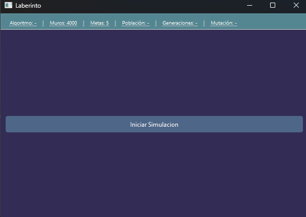
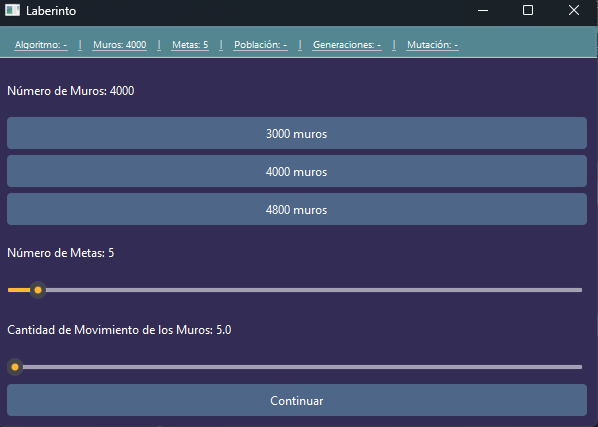
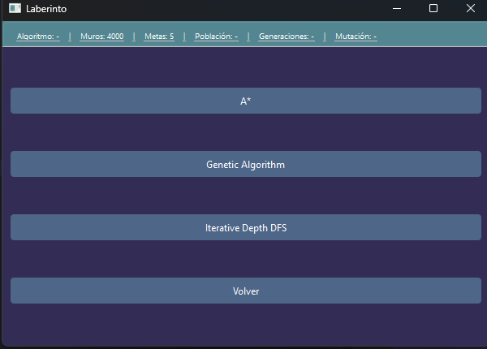
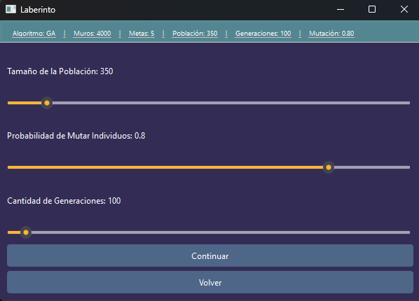
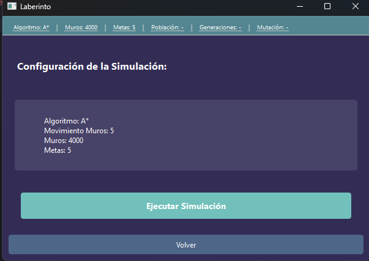
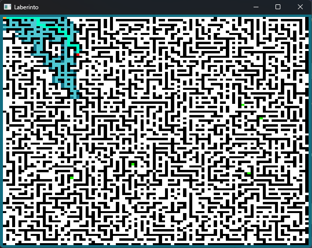

# Tarea 1 del ramo Inteligencia Artificial

> **Nota:** Este proyecto fue desarrollado en Windows.

Integrantes:
- Andrés Chaparro 
- Bastián Bernal 
- Valeria Quiroga Carrere 

## Descripción

### Problema

Un grupo de exploradores se encuentra perdido en un laberinto y debe buscar la salida. Cuentan con un mapa que usaran para orientarse en el que deben trazar un camino hasta la salida, sin embargo, hay más de una y solo podrán saber cuál es la correcta una vez las alcancen. Además, una vez empiezan a avanzar se dan cuenta que los muros se mueven constantemente. Para salvar a los exploradores es necesario encontrar la salida real antes de que se les acabe el tiempo. ¿Cuál es el método para este objetivo?

### Métodos implementados

Para generar los caminos de los exploradores se implentaronde

 - Algoritmo Genético
 - A*

## Instalación

### Requisitos previos
- Python 3.7 o superior
- pip (gestor de paquetes de Python)

### Instalar dependencias

Para instalar todas las dependencias necesarias, ejecuta el siguiente comando en la terminal:

```bash
pip install -r requirements.txt
```

Este comando instalará automáticamente las siguientes librerías:
- **numpy**: Para cálculos numéricos y manejo de arrays
- **PySide6**: Para la interfaz gráfica del usuario
- **pandas**: Para manejo y análisis de datos

## Ejecución

### Ejecutar la aplicación

Una vez instaladas las dependencias, puedes ejecutar la simulación con:

```bash
python main.py
```

Si quieres ejecutar los experimentos:
```bash
python run_experiments.py
```

### Modos de ejecución

Hay dos modos de ejecución que se escogen desde la terminal: 
 - la simulación, que cuenta con interfaz gráfica y deja modificar los parámetros. 
 - los experimentos, que corren una serie de tests con parámetros predeterminados para evaluar el desempeño de los algoritmos. Los resultados son guardados en la carpeta results.

### Simulación
Estas son las interfaces dentro de la simulación.
#### Pantalla Principal


#### Ajustes del laberinto


#### Selección de algoritmo


#### Selección de parámetros 

##### (Solo si se selecciona el algoritmo genérico)

#### Ejecución


#### Simulación
